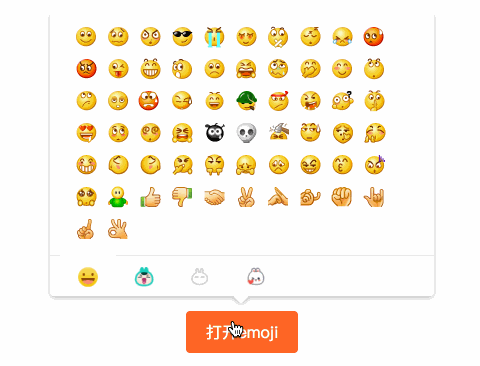

# FT-EMOJI

表情包项目，目前支持四套表情：emoji、小团、流氓兔、欢乐兔
功能有：表情包弹出层的渲染、emoji对象提供的parse方法可以解析含有表情的格式化文字


## 接口说明

- init 用于Emoji的初始化
- open 打开Emoji弹出层 （仅限于PC）
- close 关闭Emoji弹出层
- parse 用于解析含有emoji的格式化文字，该接口会返回如下富文本
```html
<i class="emoji-icon emoji-icon-3 emoji-icon-3-15"></i>
```
- init(opts) opts为初始化配置对象，以下为opts属性
- containerId 锚点element的id，PC组件：该id用于点击弹出层以外区域自动关闭的逻辑判断  APP组件：盛放emoji的容器元素的id
- emojiClickCallback 点击表情的回调，会传入该表情对应的文字，如果需要点击之后关闭弹出层可以在该回调方法里手动调用close方法
- type 'app'or'pc', 不设置该字段的话默认pc

```js
import Emoji from 'ft-emoji/lib/app.js'
import PCEmoji from 'ft-emoji/lib/pc.js'
var emoji=new Emoji()
emoji.init({
        containerId:'emojiContainer',
        type:'app',
        emojiClickCallback:function(str){
            console.log(str)
        }
    })
emoji=new PCEmoji()
emoji.init({
        containerId:'emojiTrigger',
        emojiClickCallback:function(str){
            console.log(str)
        }
    })
var emojiTrigger=document.getElementById('emojiTrigger')
emojiTrigger.addEventListener('click',function(){
    emoji.open()
})
emoji.open()
var $result=document.getElementById('result')
result.innerHTML=emoji.parse('[OK][小团_OK]小团_OK[流氓兔_再见]流氓兔_再见[欢乐兔_走开]欢乐兔_走开')
```
## Demo


[线上demo地址](https://future-team.github.io/ft-emoji/examples/dist/)

## 注意事项

全局只应该有一个emoji对象，请勿多次实例化
如果安装依赖之后抛出handlebar的相关错误，请用npm安装handlebars-loader，并在webpack config文件里的loaders数组里添加
```js
{
   test: /\.html$/,
   loader: "handlebars-loader"
}
```

## 安装

```
	npm install ft-emoji --save
```


